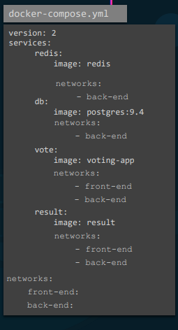

# **Docker Images**
  
## Creating our own image - Dockerfile


## Docker Compose


```docker
#build instead of image to build and use custom image 
redis:
    image: redis
db:
    image: postgres:9.4
vote:
    build: ./vote
    ports:
        - 5000:80
    links:
        - redis
result:
    build: ./result
    ports:
        - 5001:80
    links:
        - db
worker:
    build: ./worker
    links:
        - db
        - redis
```

## Env Variables
```docker
#Pass variables to container
docker run -e <ENV_VARIABLE>=<VALUE> <image>:<image_tag>
```

