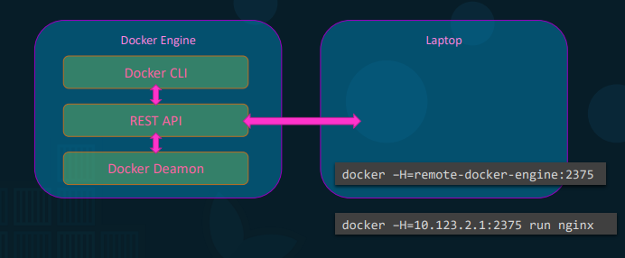
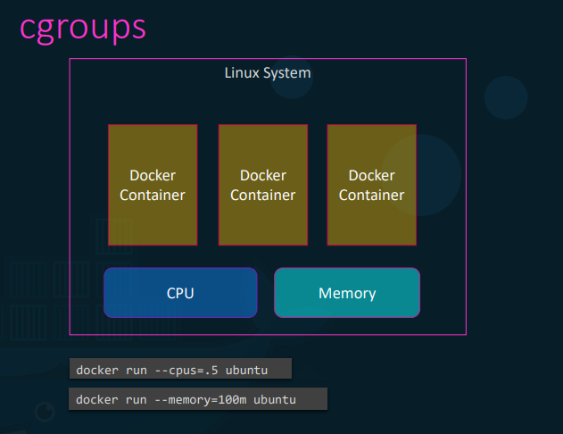
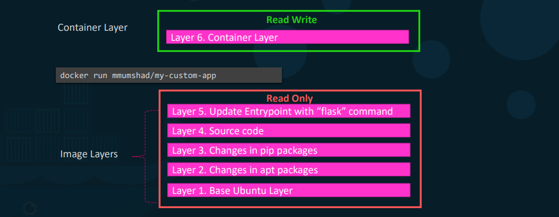
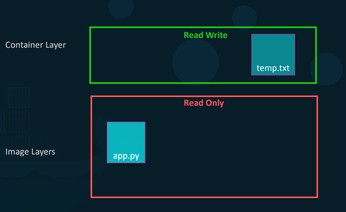

# **Docker Engine**
  
## Docker Engine Architecture


## Containerization
Is acheieved by isolating the follwing
  * Namespaces
    * PID
    * Network              
    * Mount process
    * Unix timesharing
    * InterProcess  

## Resources


## Docker Filesystem
  * /var/lib/docker
    * aufs (storage driver)
    * containers
    * image
    * volumes (default volume location)

## Container Layer





## Volumes


```docker
#Create volume
docker volume create <volume_name>

#Volume mapping
docker run --mount type=bind,source=<volume_name>,target=/var/lib/mysql mysql
```