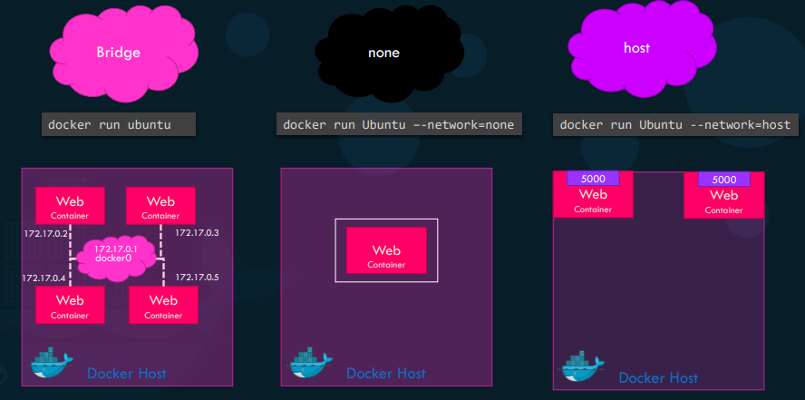
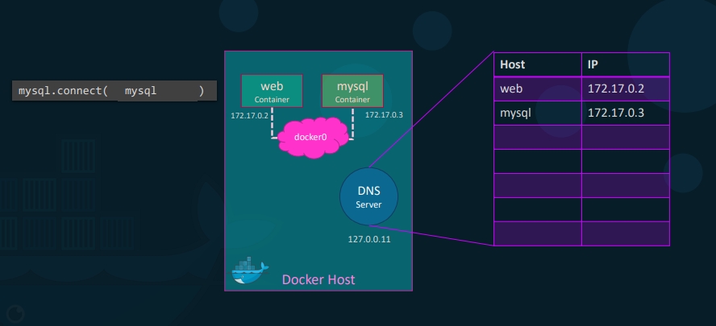

# **Docker Networking**

### Default Networks
  * Bridge (172.x.x.x)
  * None  (Cannot access network port)
  * Host (So only one Container process can a use port)  

```docker
#List all networks
docker network ls 
```


### User defined networks
```docker
#Create a user defined network
docker network create \
–-driver bridge \
-–subnet 182.18.0.0/16
<network-name>

#Use docker inspect command to see networks associated with a container
```

### Docker DNS Server
**DNS Server runs at 127.0.0.11**
  




